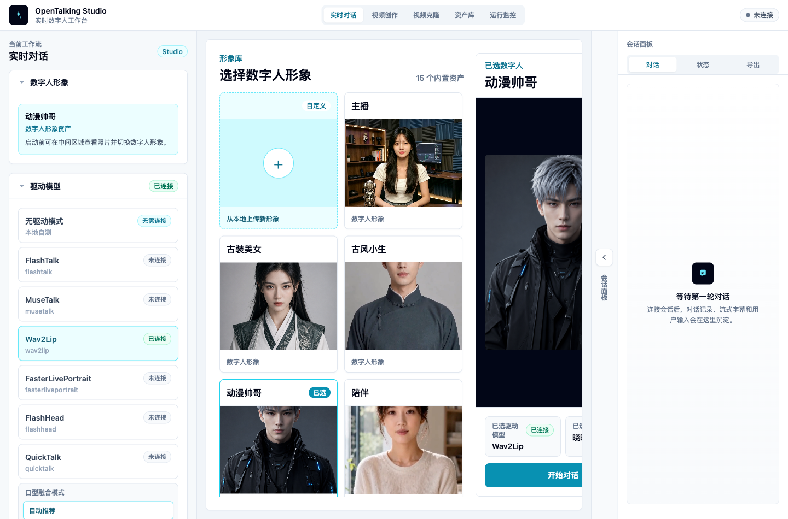
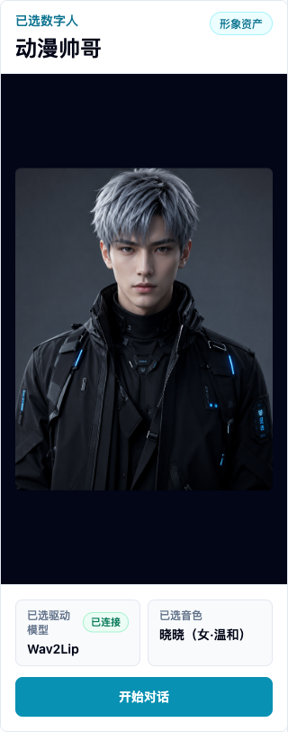

# WebUI Basic Usage

WebUI is OpenTalking's interactive workspace for avatar selection, model selection, voice configuration, and conversation validation. It is useful for quick checks and for letting non-engineering teammates preview the digital human experience.

## What WebUI Is For

Use WebUI to:

- Select built-in or custom avatars.
- Choose the model for the current session.
- Select TTS provider and voice.
- Converse through text or voice.
- Inspect connection status, session state, and errors.

WebUI is not a production admin system or a full asset management platform. It is a visual validation and debugging entry point.

## Workflow Entrypoints

The top navigation exposes different workflows:

- “Realtime Conversation”: select avatar, model, and voice, then enter the LLM / TTS / talking-head pipeline.
- “Video Creation”: select an avatar and audio source, then generate an offline digital-human video.
- “Video Clone”: keep one digital-human asset as the source, then drive its expression and head motion with a camera or uploaded video.

Video Creation and Video Clone are independent from the realtime conversation `speak` queue. Video Creation is for downloadable narrated videos. Video Clone is for validating camera-driven expression cloning after the FasterLivePortrait runtime is available.

## Open WebUI

Start services with:

```bash
bash scripts/start_unified.sh --mock
```

The script prints the WebUI URL. The default is:

```text
http://127.0.0.1:5173
```

If you changed ports, use the URL printed by the terminal.



*WebUI first screen: workflow tabs, model selection, avatar library, and session panel.*

## Page Layout

### Avatar Selection

The avatar area lists available digital humans. Each item usually has a preview image, name, and type label. Custom avatars are marked as custom and can be deleted.

If an expected avatar is missing, confirm that it is under `OPENTALKING_AVATARS_DIR` and contains a valid `manifest.json` and preview image.

### Model Selection

Model selection controls which digital human driver model is used for the session. In Mock mode, choose a driverless/mock option. In local or OmniRT mode, make sure model weights, backend services, and startup arguments are ready.

Model capabilities and backend choices are covered in [Model Support](../../model-support/index.md).

### Voice Selection

Voice selection controls the TTS provider and voice used for generated speech. Different providers have different voice identifiers, credentials, and latency profiles.

For first validation, use the default voice. For a business-specific voice, see [Voice and TTS](./voice-and-tts.md).

### Conversation Panel

The conversation panel is used for text input, replies, and digital human playback. When voice input is enabled, the browser asks for microphone permission.

Start with short text to verify first frame, audio, and captions before testing long prompts or continuous voice.

### Video Creation Panel

After entering “Video Creation”, the page has three columns:

- Left Source: select the avatar for the narrated video, or upload an image to create a new avatar.
- Center Offline Generation: choose the generation model, title, and audio source. Audio can come from an upload, TTS text, or a cloned voice.
- Right Result: preview, download, or open the asset library after generation completes.

See [Video Creation](./video-creation.md) for the detailed workflow.

### Video Clone Panel

After entering “Video Clone”, the page has three columns:

- Left Source: select an existing avatar or upload a new source image. The source is the digital-human asset that will be driven.
- Center Output: cloned output, connection status, sent/received frames, dropped frames, and latency.
- Right Driving: select a camera, set FPS/resolution, or upload a driving video. Driving only provides expression and head motion; it does not become the identity.

For source uploads, use a clear frontal or half-body image. The uploaded image is added to the avatar library and selected automatically. Uploading a driving video is a separate flow for testing a selfie video as the motion input.

Useful controls:

- “Pasteback”: preserve the original source composition instead of showing only a zoomed head.
- “Crop driving face”: off by default; enable it only when the driving face is small or unstable.
- “Mouth opening” and “lip retargeting”: tune mouth motion. Retargeting can improve mouth shape, but aggressive settings may reduce motion to simple vertical opening.
- “Animation region”: choose mouth-only for lip tests, or full expression for richer motion.

See [Video Clone](./video-clone.md) for the detailed workflow.

### Status and Errors

WebUI displays connection, session, model, and TTS errors. When something fails, read the page message first, then inspect API and WebUI logs.

## First-use Flow

### 1. Select Avatar

Select an avatar from the library. For the first run, use a built-in avatar to avoid custom asset issues.

### 2. Select Model

Choose a model that matches the startup mode:

- Mock mode: choose the mock / driverless option.
- Local QuickTalk: choose `quicktalk`.
- OmniRT backend: choose the model specified in startup arguments.

### 3. Select Voice

Use the default voice first. If multiple providers are configured, preview voices before selecting one.

### 4. Create Session

Create a session after avatar, model, and voice are selected. When creation succeeds, the page enters the conversation state.

### 5. Allow Microphone Permission

If you use voice input, allow microphone access in the browser. Text-only usage does not require it.

### 6. Start Conversation

Try a short message:

```text
Hello, please briefly introduce OpenTalking.
```

After reply, audio, and video are working, test more complex input.



*Pre-session confirmation: check avatar, driver model, and voice before clicking Start Conversation.*

## Common Operations

### Switch Avatar

After switching avatars, recreate the session. Different avatars may have different assets and model compatibility.

### Switch Model

Before switching models, make sure the backend supports the selected model. Otherwise session creation may fail.

### Switch Voice

Voice changes affect future replies. Already generated audio is not re-synthesized.

### View Captions and Events

The page shows conversation text, generated replies, and some status events. For detailed backend events, inspect API logs or later reference materials.

### Use Video Creation

After OpenTalking is running:

1. Switch the top navigation to “Video Creation”.
2. Select an existing avatar on the left, or upload an image to create a narrated-video avatar.
3. Choose `quicktalk` or `wav2lip` as the generation model.
4. Choose an audio source: upload audio, synthesize text, or clone a voice first.
5. Click Generate and Save.
6. Preview the result on the right or open the asset library to download it.

### Use Video Clone

After FasterLivePortrait and OmniRT are started according to the model documentation:

1. Switch the top navigation to “Video Clone”.
2. Select an existing avatar on the left, or upload a new source image.
3. Select a camera on the right; for uploaded-video testing, upload a driving video.
4. Adjust FPS, resolution, animation region, and mouth controls as needed.
5. Click Start and inspect the output in the center.
6. Click Stop or switch pages to release the camera and WebSocket.

### Stop or Recreate Session

If inference stalls, audio breaks, or configuration changes behave unexpectedly, stop the current session and create a new one. If needed, restart services:

```bash
bash scripts/quickstart/stop_all.sh
```

## Common Issues

### Blank Page or Failed Assets

Check that the WebUI dev server is still running and that the frontend has no compilation errors.

### Session Creation Fails

Check API status:

```bash
bash scripts/quickstart/status.sh
```

Then confirm the selected model matches the backend that was started.

### No Audio

Check browser mute state, TTS provider configuration, voice availability, credentials, and network access.

### Microphone Unavailable

Check browser permissions, system microphone permissions, and whether the page is opened from `localhost` or `127.0.0.1`.

### Video Clone Cannot Start the Camera

Open the page from `localhost` or `127.0.0.1`, allow camera permissions, and make sure the camera is not occupied by another app. If camera access is unavailable, upload a driving video first to validate the backend video-clone service.

### Video Clone Service Connection Fails

Check `/video-clone/status`, then verify that the OmniRT FasterLivePortrait runtime is running. Startup steps are covered in [FasterLivePortrait](../../model-support/models/fasterliveportrait.md).
