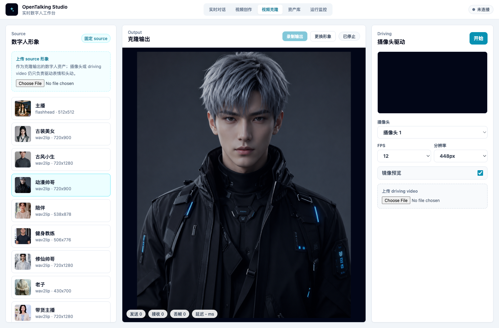

# Video Clone

Video Clone keeps one digital-human avatar as the source and uses a camera or uploaded video as the driving input. The driving input controls expression, head motion, and mouth motion on the source avatar.

It does not enter the LLM / STT / TTS conversation path and does not reuse the Realtime Conversation `speak` queue. The main v1 flow is live camera driving; uploaded driving video is available for testing a recorded selfie video.



*Video Clone page: source avatar on the left, clone output in the center, and camera or driving-video controls on the right.*

## Prerequisites

Video Clone depends on the FasterLivePortrait runtime. Start OmniRT according to the [FasterLivePortrait guide](../../model-support/models/fasterliveportrait.md), then confirm OpenTalking can see the video-clone status.

Common check:

```bash
curl -s http://127.0.0.1:8000/video-clone/status | jq
```

If the status is disconnected, check the OmniRT endpoint, FasterLivePortrait source dependency, and model weight paths.

## Source and Driving

Two concepts matter:

- `source`: the digital-human avatar shown in the final output. It comes from the OpenTalking avatar library or from an uploaded source image.
- `driving`: the face input that provides expression, head motion, and mouth motion. It can come from a camera or uploaded driving video.

The camera user does not become the digital-human identity. The camera only provides the motion signal; the output remains the selected source avatar.

## Page Layout

### Left Source

Use the left column to fix the source avatar:

- Click an existing avatar to switch the source.
- Click Upload Source Image to upload a local image as a new source.
- After upload, OpenTalking adds the image to the avatar library and selects it.

Use a clear frontal or half-body image. Avoid heavy occlusion, extreme side faces, or very dark images.

### Center Output

The center column shows clone output. The top controls include:

- “Record output”: record the current output and save it to the exported video asset library.
- “Change avatar”: return to source selection.
- Status button: shows stopped, connecting, or running state.

The bottom status shows sent frames, received frames, dropped frames, and latency.

### Right Driving

The right column configures driving input:

- “Camera”: select the local camera.
- “FPS”: frontend frame sampling rate.
- “Resolution”: frame size sent to the runtime.
- “Mirror preview”: mirrors camera preview and sent frames for selfie use.
- “Upload driving video”: loop a local video as the driving input.

If the browser cannot open the camera, upload a driving video first to validate the backend service.

## Steps

1. Start the FasterLivePortrait OmniRT runtime.
2. Start OpenTalking and open WebUI.
3. Switch the top navigation to “Video Clone”.
4. Select a source avatar on the left, or upload a new source image.
5. Select a camera on the right, or upload a driving video.
6. Adjust FPS, resolution, animation region, and mouth controls as needed.
7. Click Start.
8. Inspect the center output; click Record Output when you need to save it.
9. Click Stop or switch workflows to release camera tracks, WebSocket, and the current clone session.

## Parameter Tips

### Pasteback

Keep it enabled by default. Pasteback preserves the original source composition and avoids showing only a zoomed face.

### Crop Driving Face

Keep it disabled by default. Over-cropping uploaded driving video can make mouth shape and head position feel unnatural. Enable it only when the driving face is too small or face detection is unstable.

### Animation Region

- “Full expression”: full head motion and expression demo.
- “Expression”: expression-focused motion.
- “Pose”: head-pose-focused motion.
- “Mouth”: lip-only checks.
- “Eyes”: blink and eye-motion checks.

### Mouth Controls

Mouth opening increases or reduces mouth amplitude. Lip retargeting can improve mouth closure, but aggressive settings may collapse motion into simple vertical opening. Change one parameter at a time.

## Uploaded Driving Video

Uploaded driving video does not change the source identity. It only provides motion input.

Recommended driving video:

- Clear, unobstructed face.
- Face not too far from the camera.
- Face stays in frame.
- Short clips for initial tuning.

If uploaded video makes the mouth look puffy or unable to open, disable Crop Driving Face first, then check face position and scale in the driving video.

## Common Issues

### Camera Does Not Open

Open the page from `localhost` or `127.0.0.1`, allow camera permission, and make sure the camera is not occupied by another application.

### Video Clone Service Fails to Connect

Check `/video-clone/status`, confirm the FasterLivePortrait runtime is running, and verify the OpenTalking OmniRT endpoint points to the right service.

### Mouth Only Opens Vertically

Reduce lip retargeting strength, or switch back to a fuller animation region. Mouth-only is useful for lip checks, but full demos should usually use Full Expression.

### Head Is Zoomed In

Enable Pasteback. If the source image itself is face-heavy, use a half-body or wider-composition source image.
