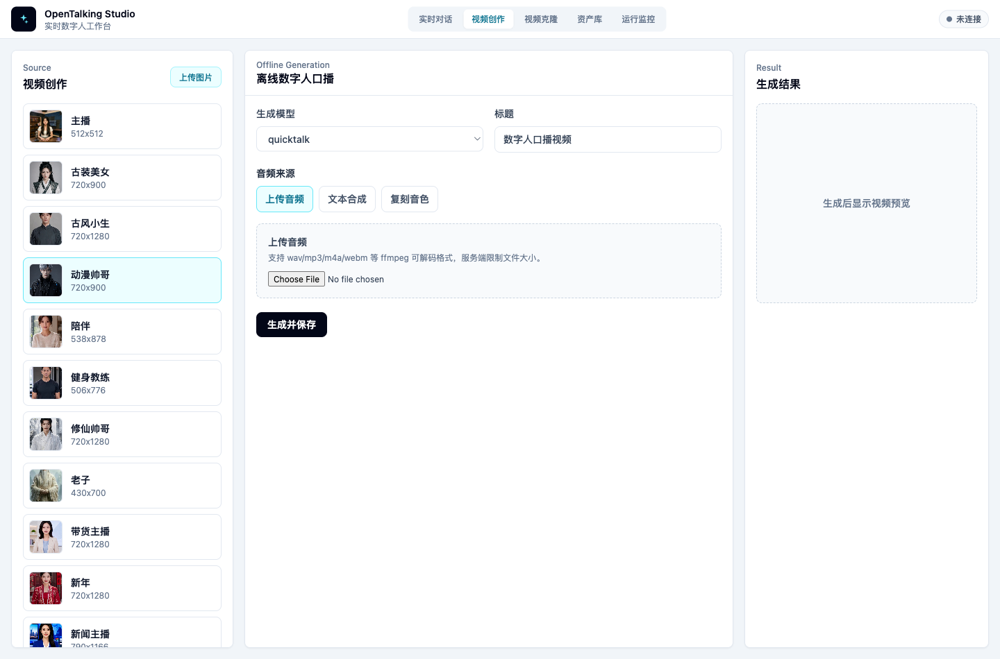

# Video Creation

Video Creation generates a downloadable narrated digital-human video. It differs from Realtime Conversation: you choose the avatar, audio source, and generation model first, then the backend generates the video offline and stores the result in the exported video asset library.

## When to Use It

Use Video Creation for:

- Product demos, course narration, news broadcasts, and other file-based outputs.
- Uploading a prepared audio track and generating the matching talking-head video.
- Entering narration text, synthesizing audio with TTS, then generating video.
- Cloning a voice first, then using that cloned voice for narration.

It is not a realtime Q&A workflow and does not enter the LLM / STT / WebRTC conversation path.

*Video Creation page: choose the source avatar on the left, configure offline generation in the center, and preview the result on the right.*

## Prerequisites

Start OpenTalking and make sure the target talking-head model is available:

- `quicktalk`: lightweight realtime or near-realtime narration generation.
- `wav2lip`: lip-sync generation from existing audio.

You can open WebUI in Mock mode to learn the interface, but real video generation requires a model backend.

## Page Layout

### Source

The left Source area selects the digital human used in the video. Choose an existing avatar or click Upload Image to create a new image avatar.

Use a clear frontal or half-body image for uploads. After processing, the new image is added to the avatar library.

### Offline Generation

The center area controls generation:

- “Generation model”: choose `quicktalk` or `wav2lip`.
- “Title”: saved title in the exported video library.
- “Audio source”: where the narration audio comes from.

Audio sources:

- “Upload audio”: upload a `wav`, `mp3`, `m4a`, `webm`, or other supported audio file.
- “Text synthesis”: enter narration text and use the current TTS provider and voice.
- “Cloned voice”: create a new voice from sample audio, then synthesize narration with it.

For text synthesis and cloned voices, preview the narration first before generating the video.

### Result

The right Result area shows the generated preview, download link, and asset-library entry. Generated videos are stored in the exported video asset library, where you can view, download, or delete them later.

## Steps

1. Open WebUI and switch the top navigation to “Video Creation”.
2. Select an avatar on the left, or upload an image to create one.
3. Choose the generation model in the center.
4. Enter a title.
5. Choose the audio source.
6. For text synthesis or cloned voice, preview the narration first.
7. Click Generate and Save.
8. Preview the result on the right, or open the asset library.

## Choosing Audio Source

### Upload Audio

Use this when you already have recorded narration, edited voice-over, or audio generated by an external TTS tool. Start with a short clip for validation.

### Text Synthesis

Use this for quick narration generation. Enter the script, then choose a TTS provider and voice. Preview and generation use the same TTS settings.

### Cloned Voice

Use this when the video needs a fixed brand or host voice. After cloning succeeds, WebUI applies the new voice to the current Video Creation flow.

## Common Issues

### Generation Model Is Disabled

The backend has not exposed that model. Check `--backend`, `--model`, or whether the OmniRT / local runtime is running.

### Uploaded Audio Fails

Check audio format, file size, and API logs. If unsure, try a 3-5 second `wav` file first.

### TTS Preview Fails

Check provider credentials, voice id, and network access. Cloud TTS failures happen before talking-head generation starts.

### Result Does Not Preview

Read the page error first, then inspect API logs. If generation succeeded but playback fails, confirm that the browser supports the returned video codec.
